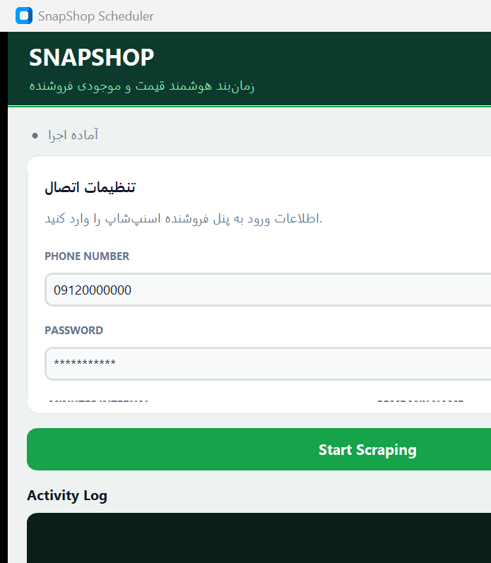

# راهنمای اپلیکیشن SnapShop Scheduler



## این اپ چه کاری انجام می‌دهد؟

این برنامه یک **زمان‌بند خودکار برای مدیریت قیمت و موجودی** فروشنده در فروشگاه اینترنتی **اسنپ‌شاپ (SnappShop)** است. با ورود به پنل فروشنده، داده‌های محصولات را استخراج می‌کند، قیمت‌ها را بر اساس قوانین رقابتی (Buybox) تنظیم می‌کند و فایل به‌روزرسانی را دوباره در پنل آپلود می‌کند.

## قابلیت‌های اصلی

1. **ورود خودکار به پنل فروشنده**  
   با شماره موبایل و رمز عبور (یا کد تأیید) وارد `seller.snappshop.ir` می‌شود.

2. **دانلود فایل موجودی**  
   از بخش به‌روزرسانی گروهی (`bulk-update`) فایل اکسل محصولات را دانلود می‌کند.

3. **اسکرپ Buybox (اختیاری)**  
   صفحه فروشنده در اسنپ‌شاپ را می‌گردد، قیمت فروشنده دوم و وضعیت بای‌باکس را جمع‌آوری می‌کند تا بتوان قیمت رقابتی تعیین کرد.

4. **محاسبه و تنظیم قیمت تخفیف**  
   برای محصولاتی که فعال‌اند و تخفیف دارند، قیمت بعد از تخفیف را طوری تنظیم می‌کند که نسبت به بای‌باکس رقابتی بماند (مثلاً کمی پایین‌تر از قیمت رقیب).

5. **زمان‌بندی دوره‌ای**  
   همین فرایند را در بازه زمانی مشخص (مثلاً هر ۲۰ دقیقه) به‌صورت خودکار تکرار می‌کند.

6. **لاگ زنده**  
   وضعیت اجرا و خطاها در باکس پایین پنجره نمایش داده می‌شود.

## فیلدهای رابط کاربری

| فیلد | توضیح |
|------|--------|
| **Phone Number** | شماره موبایل حساب فروشنده اسنپ‌شاپ |
| **Password** | رمز عبور حساب (در صورت غیرفعال کردن «Use password»، منتظر ورود دستی کد می‌ماند) |
| **Minutes Interval** | فاصله زمانی تکرار اسکرپ (به دقیقه) |
| **Seller Store URL** | آدرس صفحه فروشنده در اسنپ‌شاپ |
| **Company Name** | نام فروشگاه (مثلاً «چادوک») برای تشخیص فروشنده در بای‌باکس |
| **Skip Buybox scraping** | در صورت فعال بودن، مرحله جمع‌آوری قیمت بای‌باکس رد می‌شود |

## جریان کار به‌صورت خلاصه

```text
شروع → ورود به پنل فروشنده
     → دانلود اکسل موجودی
     → (اختیاری) اسکرپ قیمت بای‌باکس از صفحه عمومی فروشنده
     → فیلتر محصولات فعال دارای تخفیف
     → به‌روزرسانی تاریخ/ساعت شروع تخفیف
     → محاسبه قیمت رقابتی
     → ساخت فایل 01.xlsx و آپلود در پنل
     → تکرار طبق بازه زمانی
```

## خروجی

نتیجه نهایی معمولاً فایل اکسل `01.xlsx` در پوشه `downloads` است که سپس به‌صورت خودکار در بخش به‌روزرسانی گروهی پنل فروشنده آپلود می‌شود.
